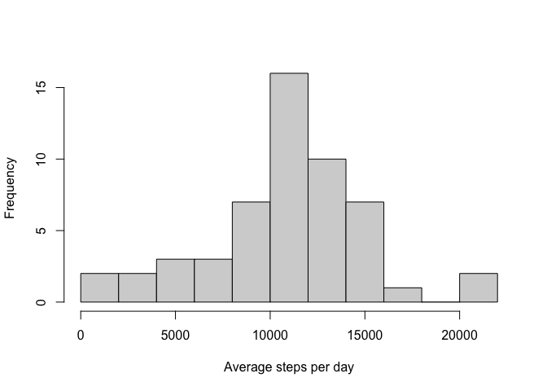
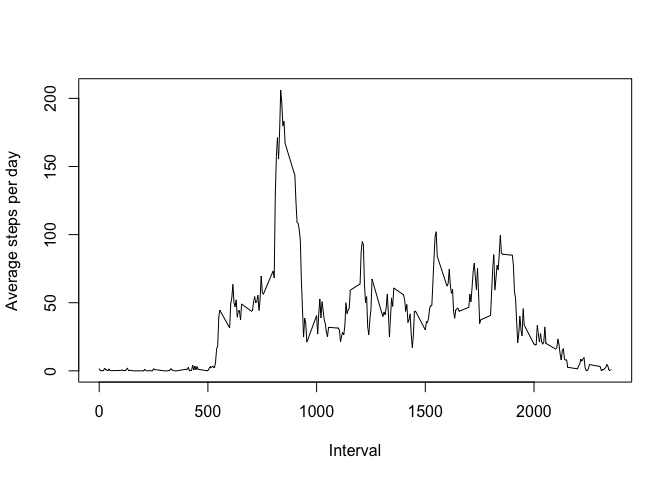
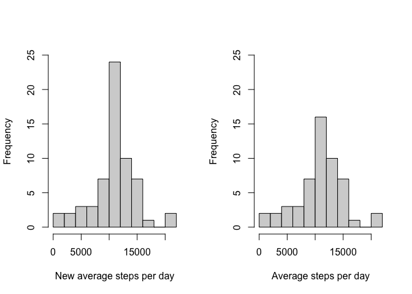
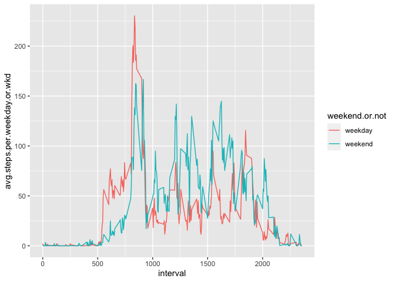

## Loading and preprocessing the data


```r
library(dplyr)
```

```
## 
## Attaching package: 'dplyr'
```

```
## The following objects are masked from 'package:stats':
## 
##     filter, lag
```

```
## The following objects are masked from 'package:base':
## 
##     intersect, setdiff, setequal, union
```

```r
library(tibble)
library(ggplot2)

activity <- read.csv("activity.csv")
```

## What is mean total number of steps taken per day?

1.Calculate the total number of steps taken per day


```r
act2<-mutate_at(activity, "date", as.character)

act3<-mutate_at(act2,"date",as.Date,format = "%Y-%m-%d")

act4<-act3 %>% group_by(date) %>%  summarise(avg.steps.per.day=sum(steps))
```

```
## `summarise()` ungrouping output (override with `.groups` argument)
```

```r
head(act4)
```

```
## # A tibble: 6 x 2
##   date       avg.steps.per.day
##   <date>                 <int>
## 1 2012-10-01                NA
## 2 2012-10-02               126
## 3 2012-10-03             11352
## 4 2012-10-04             12116
## 5 2012-10-05             13294
## 6 2012-10-06             15420
```

2.Make a histogram of the total number of steps taken each day


```r
hist(act4$avg.steps.per.day, xlab = "Average steps per day", ylab = "Frequency",main="",breaks = 10)
```

<!-- -->

3.Calculate and report the mean and median of the total number of steps taken per day


```r
mean(act4$avg.steps.per.day, na.rm = TRUE)
```

```
## [1] 10766.19
```

```r
median(act4$avg.steps.per.day, na.rm = TRUE)
```

```
## [1] 10765
```

## What is the average daily activity pattern?

1.Make a time series plot of the 5-minute interval (x-axis) and the average number of steps taken, averaged across all days (y-axis)

```r
act5<-act3 %>% group_by(interval) %>%  summarise(avg.steps.per.interval=mean(steps,na.rm = TRUE))
```

```
## `summarise()` ungrouping output (override with `.groups` argument)
```

```r
plot(act5$interval,act5$avg.steps.per.interval,type = "l",xlab = "Interval", ylab = "Average steps per day",main="")
```

<!-- -->

2.Which 5-minute interval, on average across all the days in the dataset, contains the maximum number of steps?


```r
order(act5$avg.steps.per.interval, decreasing = TRUE)
```

```
##   [1] 104 105 107 106 103 101 108 100 102 109  99 110 111 112 113 191 226 190
##  [19] 114 147 148 146 227 228 225 220 229 192 189 210 230 223 213 219 195 224
##  [37]  97 209  94 211  98 222 156 115 188 194 145  76 149 196 193 208 168 198
##  [55] 212 221 144 231 218  95 197 214 162 206  96 169  91  88 151  75 166 232
##  [73] 124  93  79 170  90 126 207  87 150 140  77  89  74  84 172 187 186 167
##  [91]  78 205 161 203 143 185 239 202 116 155 201 142  72  86  92 127  82  81
## [109] 199  85 180 204 179 171 159 163 123 157 141 175 160 217 121 236 165 158
## [127]  71  80 125 184 118 200 154 174 216 128  83 233 182 183 173 119 215 129
## [145] 240 139 244 152 251 132  73 133 237 181 134 137 130 176 235 247 122 245
## [163] 153 138 178 136 238 164 131 117 255 248 135 250 246 120 234 252 241 249
## [181] 243 256 242  70 254 177 260  69 253 259 257 271 270 261 268 263 258 262
## [199] 269  68 267 284 276  55 266  57  65 277 285  59  63  66 278 264 283  51
## [217]  64 272   6  67  19   1  43 275 282  62  35  10 265  49  27  18  60 288
## [235] 281  36  50   8  58 280  14  56 286  42  44   7  45  22  54   2  16  53
## [253]  13 273  11  23  32 287  41  20  21   4  15   3  12  30 274   5  46   9
## [271]  17  24  25  26  28  29  31  33  34  37  38  39  40  47  48  52  61 279
```

```r
act5[104,]
```

```
## # A tibble: 1 x 2
##   interval avg.steps.per.interval
##      <int>                  <dbl>
## 1      835                   206.
```


## Imputing missing values

1.Calculate and report the total number of missing values in the dataset (i.e. the total number of rows with NAs)

```r
summary(is.na(act3$steps))
```

```
##    Mode   FALSE    TRUE 
## logical   15264    2304
```

2.Devise a strategy for filling in all of the missing values in the dataset. The strategy does not need to be sophisticated. For example, you could use the mean/median for that day, or the mean for that 5-minute interval, etc.

3.Create a new dataset that is equal to the original dataset but with the missing data filled in.


```r
act6<-full_join(act3,act5,by = "interval")

new.steps<-numeric(0) 

for (i in 1:17568){
  if (is.na(act6$steps[i])) { 
    new.steps<-append(new.steps,act6$avg.steps.per.interval[i])
  } else {
    new.steps<-append(new.steps,act6$steps[i])
  }
}

act7<-cbind(act6,new.steps) 


act8<-as.tibble(act7)
```

```
## Warning: `as.tibble()` is deprecated as of tibble 2.0.0.
## Please use `as_tibble()` instead.
## The signature and semantics have changed, see `?as_tibble`.
## This warning is displayed once every 8 hours.
## Call `lifecycle::last_warnings()` to see where this warning was generated.
```

```r
head(act8)
```

```
## # A tibble: 6 x 5
##   steps date       interval avg.steps.per.interval new.steps
##   <int> <date>        <int>                  <dbl>     <dbl>
## 1    NA 2012-10-01        0                 1.72      1.72  
## 2    NA 2012-10-01        5                 0.340     0.340 
## 3    NA 2012-10-01       10                 0.132     0.132 
## 4    NA 2012-10-01       15                 0.151     0.151 
## 5    NA 2012-10-01       20                 0.0755    0.0755
## 6    NA 2012-10-01       25                 2.09      2.09
```


4.Make a histogram of the total number of steps taken each day and Calculate and report the mean and median total number of steps taken per day. Do these values differ from the estimates from the first part of the assignment? What is the impact of imputing missing data on the estimates of the total daily number of steps?


```r
act9<-act8 %>% group_by(date) %>%  summarise(new.avg.steps.per.day=sum(new.steps))
```

```
## `summarise()` ungrouping output (override with `.groups` argument)
```

```r
par(mfrow = c(1, 2))
hist(act9$new.avg.steps.per.day,xlab = "New average steps per day", ylab = "Frequency",main="",ylim = c(0,25),breaks = 10)
hist(act4$avg.steps.per.day,xlab = "Average steps per day",main="",ylim = c(0,25),breaks=10)
```

<!-- -->

Mean without missing values

```r
mean(act9$new.avg.steps.per.day)
```

```
## [1] 10766.19
```

Median without missing values

```r
median(act9$new.avg.steps.per.day)
```

```
## [1] 10766.19
```

Mean with missing values

```r
mean(act4$avg.steps.per.day, na.rm = TRUE)
```

```
## [1] 10766.19
```

Median with missing values


```r
median(act4$avg.steps.per.day, na.rm = TRUE)
```

```
## [1] 10765
```

Based on the mean and median values (for all days) for the average steps taken per day, their is not much difference in the original data with missing values compared to the new dataset with missing values replaced.  However, based on the plotted histogram of the 2 datasets, there is cleary a difference.  A more in depth analysis should be performed to investigate this.

## Are there differences in activity patterns between weekdays and weekends?

1.Create a new factor variable in the dataset with two levels – “weekday” and “weekend” indicating whether a given date is a weekday or weekend day.


```r
library(timeDate)
act11<-act8%>%mutate(weekend.or.not=isWeekday(date,wday = 1:5))   
head(act11)
```

```
## # A tibble: 6 x 6
##   steps date       interval avg.steps.per.interval new.steps weekend.or.not
##   <int> <date>        <int>                  <dbl>     <dbl> <lgl>         
## 1    NA 2012-10-01        0                 1.72      1.72   TRUE          
## 2    NA 2012-10-01        5                 0.340     0.340  TRUE          
## 3    NA 2012-10-01       10                 0.132     0.132  TRUE          
## 4    NA 2012-10-01       15                 0.151     0.151  TRUE          
## 5    NA 2012-10-01       20                 0.0755    0.0755 TRUE          
## 6    NA 2012-10-01       25                 2.09      2.09   TRUE
```

2.Make a panel plot containing a time series plot (i.e.
type = "l") of the 5-minute interval (x-axis) and the average number of steps taken, averaged across all weekday days or weekend days (y-axis).


```r
act11<-act8%>%mutate(weekend.or.not=isWeekday(date,wday = 1:5))   

act12<-mutate_at(act11, "weekend.or.not", as.character)

act13<-mutate_at(act12, "weekend.or.not", as.factor)

act14<-mutate_at(act13, "weekend.or.not", gsub,pattern="FALSE",replacement="weekend")
act15<-mutate_at(act14, "weekend.or.not", gsub,pattern="TRUE",replacement="weekday")

act16<-act15 %>% group_by(weekend.or.not,interval) %>%  summarise(avg.steps.per.weekday.or.wkd=mean(new.steps))
```

```
## `summarise()` regrouping output by 'weekend.or.not' (override with `.groups` argument)
```

```r
ggplot(act16, aes(interval, avg.steps.per.weekday.or.wkd, fill = weekend.or.not))+
  geom_line(aes(color= weekend.or.not))
```

<!-- -->


